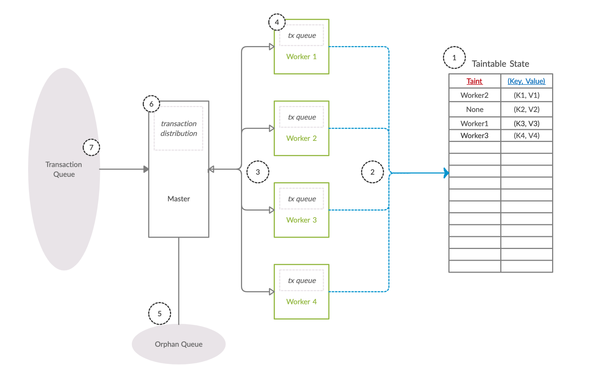

# Sonic Chain


> A wait-free, pseudo-static approach toward concurrency in blockchain runtimes 🚀.

> This work (design, implementation, and the writing) has been submitted as my thesis for a Master's degree in [Parallel and Distributed Computer Systems](https://vuweb.vu.nl/en/education/master/parallel-and-distributed-computer-systems) at [Vrije Universiteit Amsterdam](https://www.vu.nl/en/). 

- The full report (raw LaTex) can be found in [this repository](https://github.com/kianenigma/Thesis).
- Latest compiled PDF file in [this repo](./Thesis.pdf). 
- The presentation can also be found [here](./Presentation.pdf).
- [Submission to ArXiv](WAITING APPROVAL).

## Key Points

- Wait-free: Simple conflict resolution, without the need for locks, STM, or any other fancy concurrency control mechanism 🔐.
-  Pseudo-static: instead, use data that is static to the lifetime of the transaction: transaction payload as meaningful hints to predict conflicting transactions in a effective manner 🦄.
- Highly inspired by [Parity's Substrate](https://github.com/paritytech/substrate/) architecture as a scalable blockchain building framework ⚙️.

## Example Runtime Module

The key point of this thesis is the introduction of static annotation on top of each transaction that should give a best-effort guess about which storage keys are going to be accessed during the execution of this transaction. We implement this as an attribute-like macro in Rust, namely the `#[accesss]` pattern:

```rust
#[access = (|origin|
	vec![
		<BalanceOf<R>>::key_for(origin),
		<BalanceOf<R>>::key_for(dest.clone()),
	]
)]
fn transfer(runtime, origin, dest: AccountId, value: Balance) {
	// If we fail at this step, it is fine. We have not written anything yet.
	let mut old_balance =
		BalanceOf::read(runtime, origin).or_forward()?;

	if let Some(remaining) = old_balance.free.checked_sub(value) {
		// update origin. Failure is okay.
		old_balance.free = remaining;

		BalanceOf::write(runtime, origin, old_balance)
			.expect("Origin's balance key must be owned by the current thread.");

		// update dest.
		BalanceOf::mutate(runtime, dest, |old| old.free += value).or_orphan()?;

		Ok(())
	} else {
		Err(DispatchError::LogicError("Does not have enough funds."))
	}
}
```

Note that the access macro should not contain any computation as that would turn into DoS attack vector. Instead, it should only use data which is static to the lifetime of the transaction, namely its input parameters (`origin`, `dest`, `value`).

## Architecture



## Citation

To cite this work: 


```
@article{DBLP:journals/corr/abs-2102-09073,
  author    = {Kian Paimani},
  title     = {SonicChain: {A} Wait-free, Pseudo-Static Approach Toward Concurrency
               in Blockchains},
  journal   = {CoRR},
  volume    = {abs/2102.09073},
  year      = {2021},
  url       = {https://arxiv.org/abs/2102.09073},
  eprinttype = {arXiv},
  eprint    = {2102.09073},
  timestamp = {Wed, 24 Feb 2021 15:42:45 +0100},
  biburl    = {https://dblp.org/rec/journals/corr/abs-2102-09073.bib},
  bibsource = {dblp computer science bibliography, https://dblp.org}
}
```
